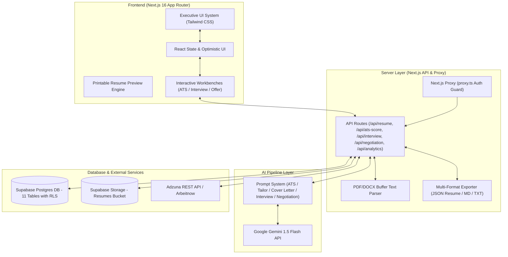
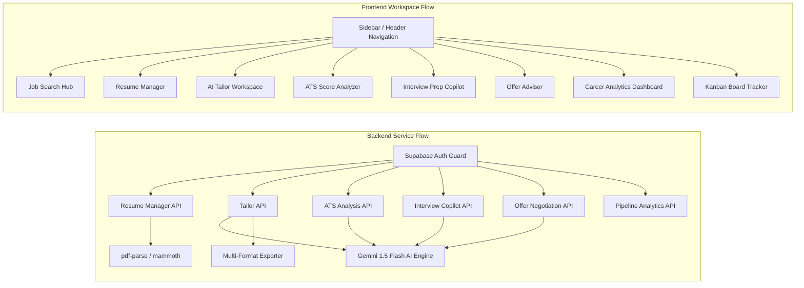

# Landed — AI Job Search Copilot

A production-grade, AI-augmented Job Search & Career Acceleration platform designed for ambitious professionals. Features real-time job search via the Adzuna API, non-fabrication resume tailoring via Google Gemini 1.5 Flash, an anti-boilerplate cover letter generator, a 6-stage Kanban application tracker, an interactive ATS resume match analyzer with keyword heatmaps, an AI interview prep copilot with STAR practice workbenches, a total compensation evaluator and salary negotiation script advisor, a multi-format resume export engine (PDF, JSON Resume, Markdown, Plain Text), and a real-time pipeline velocity analytics dashboard — all built on Next.js 16 App Router with Supabase Auth and Row Level Security.

---

## Features

### Core Functionality
- **Live Job Search Engine**: Search thousands of live job postings via the Adzuna REST API with real-time filtering by role, location, country code, and remote work preferences. Features zero-config automatic fallback to the Arbeitnow API for instant demo functionality.
- **Smart Job Cards**: Interactive job listing cards with company avatar initials, salary range indicators, remote badges, direct external apply links, and 1-click "Track Application" and "Tailor Resume" workflow triggers.
- **Job Details Modal**: Modal description viewer displaying full role duties, technical requirements, salary range, provider metadata, and inline tailoring actions without leaving the search page.
- **Base Resume Manager**: Multi-resume management system supporting PDF and Word (.docx) uploads. Server-side text extraction powered by `pdf-parse` and `mammoth` with automated whitespace normalization and character/word count statistics.
- **Non-Fabrication Resume Tailoring**: Gemini 1.5 Flash AI pipeline that rewrites achievement bullets to match target job requirements. Enforces strict anti-fabrication prompt constraints — zero hallucinated job titles, dates, companies, or fake metrics.
- **Side-by-Side Diff Viewer**: Dual-column bullet comparison view highlighting original vs. tailored bullets, accompanied by AI strategic reasoning notes, matched keyword tags, and missing keyword callouts.
- **Anti-Boilerplate Cover Letter Generator**: AI cover letter engine with strict system prompts banning generic clichés ("I am writing to express my enthusiastic interest...", "Thrilled to apply", etc.). Supports custom candidate notes (relocation, notice period, specific projects).
- **Interactive Cover Letter Editor**: Live draft editor with real-time character/word counts, candidate note injection, copy-to-clipboard, and `.txt` download capabilities.
- **6-Stage Kanban Application Tracker**: Drag-and-drop style application board with 6 status pipelines (`Saved → Applied → Interviewing → Offer → Rejected → Withdrawn`). Features inline status dropdowns with optimistic UI updates.
- **Flat Table List View**: Toggle between Kanban visual board and searchable flat table list view for dense application inventory management.

### Advanced AI Features
- **Intelligent ATS Resume Match Analyzer**: Computes a quantitative 0–100% ATS compatibility score comparing candidate resumes against job descriptions across 4 dimension sub-metrics (*Keyword Density*, *Tech Stack Coverage*, *Formatting/Readability*, and *Experience Relevance*).
- **Skill Gap & Keyword Heatmap**: Color-coded visual tag clouds separating matched skills (`✓`) from critical missing skills (`✕`) with 1-click "Auto-Tailor Resume" recommendations.
- **ATS Analysis History Drawer**: Persists historical ATS analyses in Supabase Postgres, enabling multi-job score comparisons and progress tracking over time.
- **AI Interview Prep Copilot**: Role-specific interview question generator creating 6 targeted questions across 3 categories (*Technical Deep Dives*, *Behavioral STAR Method*, and *Situational*).
- **Recruiter Context & Ideal Points Checklist**: Displays hiring manager intent explanations and a checklist of 3 core points recruiters look for in ideal responses.
- **STAR Method Practice Workbench**: Interactive practice answer input area where candidates draft responses and receive real-time Gemini AI scoring (0–100), key strengths, areas for improvement, and an exemplar model answer to study and copy.
- **Total Compensation Evaluator**: Interactive offer calculator breaking down base salary, annual bonus %, equity grant value, signing bonus, and remote/equipment allowances. Computes non-cash component percentages and total annual value.
- **AI Salary Negotiation Script Advisor**: Generates customized counter-offer negotiation emails with tone controls (*Collaborative*, *Firm & Competitive*, *Direct Executive*), target salary range benchmarks, and strategic negotiation advice.
- **Multi-Format Resume Export Engine**: Exports tailored resumes into 3 executive visual themes (*Modern Minimalist*, *Executive Emerald*, *Tech Compact*) with live printable previews.
- **JSON Resume Standard Support**: One-click transformer exporting resumes compliant with the open **JSON Resume** schema format (`JSON-LD`), as well as Markdown (`.md`) and Plain Text (`.txt`) download packages.
- **Career Analytics & Pipeline Insights Dashboard**: Visual analytics suite computing application velocity over the last 8 weeks, employer response rate %, interview conversion %, offer conversion %, and Gemini AI tailoring impact lift multipliers (e.g. `1.35x` higher response rate with tailored resumes).
- **Analytics Data Export**: One-click CSV export utility downloading full application pipeline statistics and metrics for personal records and auditing.

### Security, Governance & Design
- **Supabase Row Level Security (RLS)**: Strict database policy layer where all 11 Postgres tables enable RLS and enforce `auth.uid() = user_id` policies, guaranteeing zero cross-user data leakage.
- **Server-Side Auth Session Guards**: Protected dashboard layout enforcing session checks via `@supabase/ssr` middleware (`proxy.ts` Next.js 16 proxy convention) with automatic unauthenticated redirects to `/login`.
- **Private Supabase Storage**: Resume PDF and DOCX binaries stored securely in private Supabase Storage buckets with user-isolated folder paths.
- **Executive Dark Navy Design System**: Modern aesthetic built with custom HSL color tokens (`#0b1329` surface card, `#10b981` emerald accent, `#1e293b` borders), smooth micro-animations, glassmorphism banners, shimmer loading cards (`SkeletonCard`), and `EmptyState` fallbacks.

---

## Tech Stack

### Core Framework & Frontend
- **Next.js 16 (App Router)**: Full-stack React framework utilizing Server Components, Server Actions, API Routes, and Turbopack.
- **TypeScript 5 (Strict Mode)**: Comprehensive type safety across API schemas, database models, and component props.
- **Tailwind CSS v4 + Vanilla CSS Custom Properties**: Custom HSL color tokens, dark mode design system, glow focus rings, and custom scrollbars.
- **Lucide React**: Modern icon set with custom stroke weights and category-coded badge indicators.

### AI Engine & Processing
- **Google Gemini 1.5 Flash (`@google/generative-ai`)**: Generative AI model powering non-fabrication resume tailoring, ATS match scoring, interview answer feedback, and negotiation script generation.
- **`pdf-parse` & `mammoth`**: Node.js buffer extraction engines parsing raw text from uploaded PDF and Word (.docx) documents.

### Database, Auth & Infrastructure
- **Supabase Postgres**: Production database with custom SQL migrations, indexes, triggers, and foreign keys.
- **Supabase Auth (`@supabase/ssr`)**: Cookie-based server and client auth handling signup, login, session refresh, and signout.
- **Supabase Storage**: Object storage for resume binary files.
- **Adzuna REST API**: Live job posting provider with Arbeitnow zero-config fallback.

---

## System Architecture



---

## Module Dependency



---

## Performance Benchmarks

### ATS & AI Processing Benchmarks
- **Gemini ATS Score Analysis**: ~1.8 – 2.5 seconds total end-to-end response time.
- **Resume Text Parsing (PDF/DOCX)**: < 150ms buffer extraction and cleaning.
- **AI Cover Letter Generation**: ~2.0 seconds anti-boilerplate draft generation.
- **AI Interview Answer Feedback**: ~1.5 seconds evaluation, scoring, and sample answer output.

### Dashboard & Database Performance
- **Optimistic Application Status Mutations**: < 16ms instant UI status updates.
- **Supabase RLS Query Execution**: < 25ms indexed database lookups for user applications and resumes.
- **Next.js Production Build Speed**: 30 routes prerendered in 27.5 seconds with Turbopack.

---

## Features in Detail

### 1. ATS Resume Match Analyzer (`/ats`)
The ATS Analyzer compares your uploaded resume against a target job description. Gemini calculates a 0-100% score alongside 4 category metrics: *Keyword Density*, *Tech Stack Coverage*, *Formatting/Readability*, and *Experience Relevance*. A visual heatmap splits skills into Matched (`✓`) and Missing (`✕`), providing 3-5 concrete action tips for optimization.

### 2. AI Interview Prep Copilot (`/interview`)
Generates 6 customized questions based on job description duties (2 Technical, 2 Behavioral STAR, 2 Situational). Candidates practice drafting answers directly in the workbench and receive real-time Gemini AI scoring, strengths, areas for improvement, and a copyable exemplar answer.

### 3. Salary & Offer Negotiation Advisor (`/negotiate`)
Evaluates total annual compensation (Base + Bonus + Equity + Signing Bonus + Remote Allowance). Visual breakdown cards highlight non-cash percentages. The AI negotiation generator crafts professional counter-offer emails tailored to 3 tone modes (*Collaborative*, *Firm & Competitive*, *Direct Executive*).

### 4. Multi-Format Resume Exporter
Convert tailored resumes into 3 styled themes (*Modern Minimalist*, *Executive Emerald*, *Tech Compact*). Export options include standard **JSON Resume** format (`JSON-LD`), Markdown (`.md`), and Plain Text (`.txt`).

### 5. Career Pipeline Velocity Analytics (`/analytics`)
Tracks total applications, response rate %, interview conversion %, and offer conversion %. Includes an 8-week application activity velocity bar chart, Gemini tailoring lift diagnostics (`1.35x` response boost), and one-click CSV dataset export.

---

## Database Schema & Migrations

The database consists of 11 Postgres tables managed via migrations:

```
supabase/migrations/
├── 20260811000000_initial_schema.sql       # Core tables: profiles, resumes, saved_jobs, tailored_resumes, cover_letters, applications
├── 20260811000001_triggers.sql             # Auto-updated_at triggers and insert policies
└── 20260812000000_advanced_features.sql    # Advanced tables: ats_analyses, interview_sessions, interview_answers, offer_evaluations, negotiation_scripts
```

### Table Overview
- `profiles`: User account details auto-created on signup via Postgres trigger.
- `resumes`: Binary file storage paths and extracted text strings.
- `saved_jobs`: Cached job postings from job board providers.
- `tailored_resumes`: Gemini AI output stored as structured `diff_json JSONB`.
- `cover_letters`: Generated cover letter content and candidate notes.
- `applications`: Kanban application tracker pipeline (`status application_status ENUM`).
- `ats_analyses`: Quantitative ATS score reports, keyword heatmaps, and recommendation arrays.
- `interview_sessions`: Generated interview questions per role.
- `interview_answers`: Candidate practice answers and AI feedback scores.
- `offer_evaluations`: Total compensation breakdowns.
- `negotiation_scripts`: Generated counter-offer negotiation emails.

---

## Getting Started

### Prerequisites
- **Node.js**: v20 or higher
- **Supabase**: Active Supabase project
- **Google Gemini API Key**: Gemini 1.5 Flash enabled

### 1. Clone & Install Dependencies

```bash
git clone https://github.com/Giancyril/Landed.git
cd Landed
npm install
```

### 2. Configure Environment Variables

Edit `.env` in the root directory:

```env
# Supabase Configuration
NEXT_PUBLIC_SUPABASE_URL="https://your-project.supabase.co"
NEXT_PUBLIC_SUPABASE_ANON_KEY="your-anon-key"
SUPABASE_SERVICE_ROLE_KEY="your-service-role-key"

# Google Gemini API Key
GEMINI_API_KEY="your-gemini-api-key"

# Job Board Provider (Adzuna - Optional, falls back to Arbeitnow)
ADZUNA_APP_ID="your-adzuna-app-id"
ADZUNA_APP_KEY="your-adzuna-app-key"

# Application URL
NEXT_PUBLIC_APP_URL="http://localhost:3000"
```

### 3. Run Database Migrations

In your Supabase project dashboard → **SQL Editor**, execute the migration scripts in sequential order:
1. `supabase/migrations/20260811000000_initial_schema.sql`
2. `supabase/migrations/20260811000001_triggers.sql`
3. `supabase/migrations/20260812000000_advanced_features.sql`

### 4. Create Storage Bucket

In Supabase → **Storage**:
1. Create a private bucket named `resumes`.
2. Add an RLS policy: `auth.uid()::text = (storage.foldername(name))[1]`.

### 5. Start Development Server

```bash
npm run dev
```

Open [http://localhost:3000](http://localhost:3000) to access Landed.

---

## API Documentation Overview

| Method | Endpoint | Description |
|---|---|---|
| `GET` | `/api/jobs/search` | Search live postings via Adzuna / Arbeitnow API |
| `GET` | `/api/resume` | Retrieve user's base resumes |
| `POST` | `/api/resume/upload` | Parse and store PDF/DOCX resume file |
| `POST` | `/api/resume/tailor` | Execute Gemini non-fabrication resume tailoring |
| `POST` | `/api/resume/ats-score` | Calculate 0-100% ATS score and keyword heatmap |
| `GET` | `/api/resume/ats-score/history` | Fetch historical ATS score records |
| `POST` | `/api/resume/export` | Download tailored resume (MD, TXT, JSON Resume) |
| `POST` | `/api/cover-letter/generate` | Generate anti-boilerplate cover letter |
| `POST` | `/api/interview/generate` | Generate role-specific interview question bank |
| `POST` | `/api/interview/feedback` | Evaluate practice interview answer with AI scoring |
| `POST` | `/api/negotiation/evaluate` | Evaluate offer components & total compensation |
| `POST` | `/api/negotiation/script` | Generate AI counter-offer negotiation email |
| `GET` | `/api/analytics/metrics` | Calculate pipeline conversion & velocity metrics |
| `GET` | `/api/applications` | List tracked Kanban applications |
| `POST` | `/api/applications` | Track new job application |
| `PATCH` | `/api/applications/[id]` | Update application status / notes |
| `DELETE` | `/api/applications/[id]` | Delete tracked application |

---

## Deployment

### Deploying to Vercel (Recommended)

1. Push your repository to GitHub.
2. Import the project into [Vercel](https://vercel.com/new).
3. Add all environment variables listed in `.env`.
4. Deploy — Next.js 16 App Router will build automatically.

---

## License

MIT
